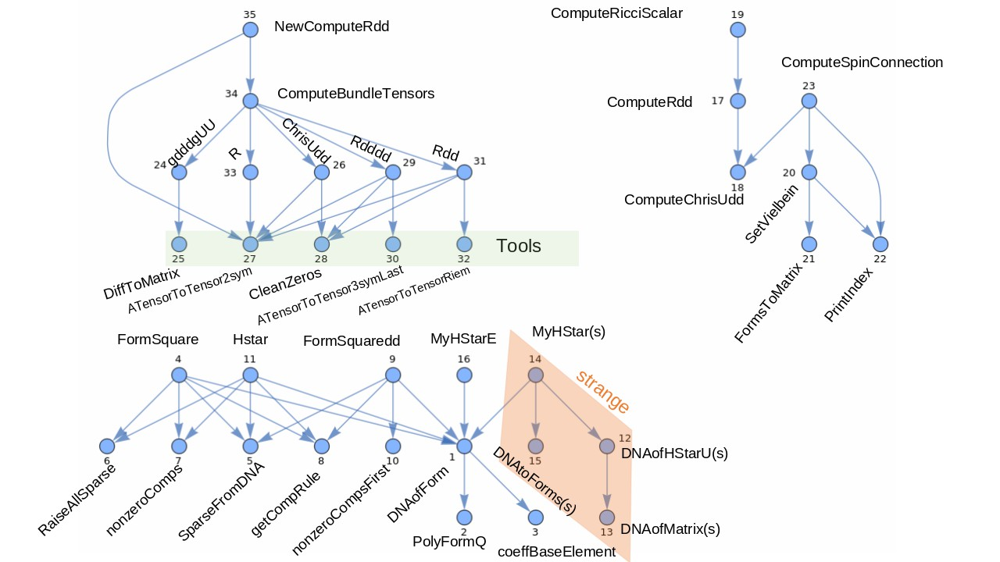

# PaillacoDiff Package Documentation

## Author
Marcelo Oyarzo

---

## Package Structure

The code is organized into the following sections:

### 1. Form Manipulation
- `FormDegree`
- `Wedge`
- `d`
- `PolyFormQ`, etc.

### 2. Gamma and Sigma Matrices
- `GamWeight`
- `GamQ`
- `CenterDot`
- `simpGamma`
- `prodGamSig`, etc.

### 3. Tensor Algebra and Contractions
- `TensorProduct`
- `Extractor`
- `coordcontraction`
- `RaiseIndices`

### 4. Hodge Star and Related Operations
- `Hstar`
- `MyHStar`
- `MyHStarE`
- `DNAofForm`
- `SparseFromDNA`, etc.

### 5. Riemannian Geometry Tools
- `DiffToMatrix`
- `Computegdd`
- `ComputeChrisUdd`
- `ComputeRdd`

### 6. Utilities
- `FormsToMatrix`
- `DNAtoMatrix`
- `DNAtoForms`

Tree of dependencies
---

#### `Wedge`
- Dependencies: `FormDegree`, `GamQ`

#### `d`
- Dependencies: `Wedge`, `FormDegree`

#### `PolyFormQ`
- Dependencies: `FormDegree`

#### `DNAofForm`
- Dependencies: `FormDegree`, `PolyFormQ`, `coeffBaseElement`
- Inputs: `X` (p-form), `coord` (coordinate list)
- Output: DNA representation of the p-form

#### `SparseFromDNA`
- Inputs: DNA of p-form, form degree `p`, `Dim` (dimension)
- Output: Sparse array representation of the form

#### `DNAFromSparse`
- Inputs: Sparse Array of a p-form
- Output: DNA of the p-form

#### `RaiseAllSparse`
- Inputs: Sparse array of a p-form, `gUU`, `p`
- Outputs: Sparse array of the p-form with upper indices

#### nonzeroComps
- Input: Sparse Array of a p-form
- Output: non-zero positions of the sparse array

#### getCompRule
- Input: tensor as Association or ArrayRules of sparse Array, basis label
- Output: component along the basis label

#### `FormSquare`
- Dependencies: `FormDegree`, `DNAofForm`, `SparseFromDNA`, `RaiseAllSparse`, `nonzeroComps`, `getcompRule`
- Input: p-form, `gUU`, simplification rule, `coord`
- Output: Square of the p-form (scalar)

#### `nonzeroCompsFirst`
- Input: Sparse array of a p-form, first index `mu` (integer)
- Output: List of the non-zero components of the tensor with first index `mu` and `mu` removed

#### `FormSquaredd`
- Dependencies: `FormDegree`, `DNAofForm`, `SparseFromDNA`, `nonzeroCompsFirst`, `getcompRule`
- Input: p-form, `gUU`, simplification rule, `coord`
- Output: symmetric rank 2 tensor square of the p-form

#### `Hstar`
- Dependencies: `FormDegree`, `DNAofForm`, `SparseFromDNA`, `RaiseAllSparse`, `nonzeroComps`, `getCompRule`
- Input: p-from, `gUU`, `sqrtdetg`, `coord`, `simplification`
- Output: dual de hodge of the p-form

#### `FormsToMatrix`
- Dependecies: `FormDegree`, `d`
- Input: p-form, `p`, `coord` 
- Output: matrix array of the p-form

#### `DNAofMatrix` (strange)
- Input: matrix array of a p-form
- Output: DNA of the p-form

#### `DNAofHStarU` (strange)
- Dependencies: `DNAofMatrix`
- Input: p-form
- Output: DNA of Hodge dual of the p-form

#### `DNAtoMatrix` (strange)
- Input: DNA of a p-form (Global: `Dim`)
- Output: matrix array of the p-form

#### `DNAtoForms` (strange)
- Input: DNA of a p-form, `coord`, `d`
- Output: p-form

#### `RaiseIndices` (strange)
- Input: Matrix of a p-form
- Output: Matrix of the p-form with upper indices

#### `MyHStar` (strange)
- Dependencies: `FormDegree`, `d`, `DNAofForm`, `DNAtoForms`, `DNAofHStarU`
- Input: p-form, simplification, `gdd`, `coord`, `gUU`, `sqrtdetg`
- Output: Hodge dual of the p-form

#### `HStarT`
- Dependencies: `MyHStar` ,`FormDegree`
- Input: p-form. (Global: `Dim`)
- Output: Hodge dual of the p-form in Tomasiello's convention

#### `MyHStarE`
- Dependencies: `FromDegree`, `DNAofForm`
- Input: p-form. (Global: `\[Eta]UU`, `Dim`)
- Output: Hodge start of the p-form in vielbein basis

### ______________ Riemannian geometry ______________

#### `ClearGeometric`
- Usage: Clear `ChrisUdd`, `Rdd`, `RicciScalar`

#### `DiffToMatrix`
- Input: metric (`ds2`), `coord`
- Output: Matrix array of the metric.

#### `Computegdd` (bundle)
- Dependencies: `DiffToMatrix`
- Input: `bundle -> ds2, coord`
- Output: Bundle updated with new keys "gdd", "sqrtdetg"

#### `ComputeChrisUdd`
- Input: simplification, `gdd`, `coord`. (global `$chrisdef`)
- Output: global `ChrisUdd`

#### `ComputeRdd`
- Dependencies: `ComputeChrisUdd`
- Input: simplification, `gdd`, `coord`. (global `$defRicciTensor`) 
- Output: global `Rdd`

#### `ComputeRicciScalar`
- Dependencies: `ComputeRdd`
- Input: simplification, `gdd`, `coord`. (global `$defRicciScalar`)
- Output: global `RicciScalar`

#### `Contractione`
- Dependencies: `FormDegree`
- Input: p-form, `Dim`
- Output: Contraction operator of the p-form

#### `SetVielbein`
- Dependencies: `FormsToMatrix`, `d`, `PrintIndex`
- Input: vielbein `eU`, `flatmetric`, simplification. (global `Dim`)
- Outbput: global `\[Eta]dd`, `\[Eta]UU`, `eTodx`, `dxToe`, `eamuUd`, `eamudU`, `gdd`, `gUU`

#### `ComputeSpinConnection`
- Dependencies: `SetVielbein`, `ComputeChrisUdd`, `PrintIndex`
- Input: vielbein `eU`, `flatmetric`, simplification. (global `dxToe`, `\[Eta]dd`, `eamuUd`, `eamudU`, `ChrisUdd`)
- Output: global `\[Omega]Ud`, `\[Omega]dd`

### ______________ Association to save tensors ______________

#### [ Utils ]

#### `CleanZeros`
- Input: Association
- Output: The association with elements with zero value removed

#### `ATensorToTensor2sym`
- Input: symmetric rank 2 Association, component `{i,j}`
- Output: component `{i,j}`

#### `ATensorToTensor3symLast`
- Input: rank 3 Association with last two symmetric, component `{i,j,k}`
- Output: component `{i,j,k}`

#### `ATensorToTensorRiem`
- Input: rank 4 Association with Riemann symmetries, component `{i,j,k,l}`
- Output: component `{i,j,k,l}`

#### `failRequirements`
- Input: bundle, array of requirements
- Output: boolean

#### [ ]

#### `PaiComputeMetric`:
- Dependencies: `DiffToMatrix`
- Input: bundle -> `coord`, `ds2`
- Output: Association with `gdd`, `gUU`

#### `PaiComputeChrisUdd`
- Dependencies: `ATensorToTensor2sym`, `CleanZeros`
- Input: bundle -> `coord`, `ATensors/Agdd`, `Tensors/gUU`
- Output: `AChrisUdd`

##### `PaiComputeRdddd`
- Dependencies: `ATensorToTensor2sym`, `ATensorToTensor3symLast`, `CleanZeros`
- Input: bunble -> `coord`, `Tensors/ChrisUdd`
- Output: `ARiemdddd`

#### `PaiComputeRdd`
- Dependencies: `ATensorToTensor2sym`, `ATensorToTensorRiem`, `CleanZeros`
- Input: bunble -> `coord`, `Tensors/gUU`, `Tensors/Rdddd`
- Output: `ARicdd`

#### `PaiComputeRicciScalar`
- Dependencies: `ATensorToTensor2sym`
- Input: bundle -> `coord`, `Tensors/gUU`, `Tensors/Rdd`
- Output: `RicciScalar`

#### `ComputeBundleTensors`
- Dependencies: `PaiComputeMetric`, `PaiComputeChrisUdd`, `PaiComputeRdddd`, `PaiComputeRdd`, `PaiComputeRicciScalar` 
- Input: `level` (string), simplification, bundle
- Output: bundle updated until `level`

#### `NewComputeRdd`
- Dependencies: `ComputeBundleTensors`, `ATensorToTensor2sym`
- Input: simplification, bundle -> `coord`
- Output: `{Rdd, bundle}` with bundle updated

#### `BuildHodge`
- Dependencies: `ComputeBundleTensors`, `ATensorToTensor2sym`, `Hstar`
- Input: simplification, bundle -> `coord`, `ATensors`
- Output: Build a Hodge star function

---
Graph of dependencies
---

## Test

wolframscript -file test/ComputeGeometry.wl 

wolframscript -file test/pForms.wl 

wolframscript -file test/bundle.wl 

